# Credit Card Payment System

Full Stack Junior Application Task

## Stack

- Frontend: React + Tailwind CSS
- Authentication/Card/Transactions/Admin: Django + Django REST Framework
- Payment processing: FastAPI
- Database: MySQL
- Authentication: JWT
- API docs: FastAPI Swagger + DRF API endpoints
- Payment: simulated only; no real gateway

## Security

- Passwords use Django's PBKDF2 password hashing.
- JWT is required for API authentication.
- CVV is never stored.
- Full card numbers are never stored.
- Only masked card number and last 4 digits are persisted.
- ORM queries are used instead of raw SQL.
- Payment amount/card ownership are validated server-side.
- Payment service requires the same Django-signed JWT and receives only a card ID, not a full PAN/CVV.
- `DJANGO_INTERNAL_SECRET` must be a random value of at least 32 characters, shared only by Django and FastAPI. Internal transaction endpoints reject missing or shorter secrets.

## Important task interpretation

The provided task PDF requires Django + FastAPI + MySQL, JWT, masked cards, simulated payment states, transaction filtering/export, admin reporting, Docker, tests, Swagger, Postman, and README documentation.

The PDF says the strict time limit is 4 days. Follow the deadline stated by your assigned team if your email says otherwise.

## Project structure

```text
credit-card-payment-system/
├── backend/
│   ├── django_backend/
│   │   ├── manage.py
│   │   ├── config/
│   │   ├── accounts/
│   │   ├── cards/
│   │   ├── transactions/
│   │   ├── audit/
│   │   └── requirements.txt
│   └── fastapi_payment/
│       ├── app/
│       └── requirements.txt
├── frontend/
│   ├── src/
│   ├── package.json
│   ├── vite.config.js
│   └── tailwind.config.js
├── postman/
│   └── Credit-Card-Payment-System.postman_collection.json
├── mysql/
│   └── init/
├── docker-compose.yml
├── .env.example
└── README.md
```

## Local setup

Run the commands below from the repository root (`credit-card-payment-system/`). If your terminal is one directory above it, enter the project first:

```powershell
cd .\credit-card-payment-system
```

Create the local environment file from the sample:

```powershell
Copy-Item .env.example .env
```

Before running the services, replace `DJANGO_SECRET_KEY` and `DJANGO_INTERNAL_SECRET` in `.env` with independently generated random values of at least 32 characters. For example, run `python -c "import secrets; print(secrets.token_urlsafe(48))"` twice and use one value for each variable. Django and FastAPI refuse a signing key shorter than 32 characters. Do not use the sample placeholders outside local development.

### 1. MySQL

For Docker, `docker compose up --build` creates the database and `appuser`
automatically; you do not need to run a MySQL setup command. If you need a
MySQL prompt, first start the database service, then run the client inside the
Compose container (the sample root password is `rootpassword`):

```powershell
docker compose up -d mysql
docker compose exec mysql mysql -uroot -p
```

When `Enter password:` appears, type `rootpassword` and press Enter; MySQL
does not display the password as you type. This is the configured credential
for the current Compose setup. Existing database volumes retain the root
password from their original initialization, so a volume created with another
password will reject this sample credential.

For a local MySQL installation, connect as a MySQL administrator. The
`mysql` command must be installed and available on `PATH`; if PowerShell says
it is not recognized, install the MySQL command-line client or add its `bin`
directory to `PATH`, then open a new terminal:

```powershell
mysql -u root -p
```

Then, for a local MySQL installation only, create the database and application
user to match `.env`:

At the `mysql>` prompt, enter only these SQL statements. Do not enter the PowerShell `mysql.exe` launch command here. If the prompt changes to `">`, type `\c` and press Enter to clear the unfinished input.

```sql
CREATE DATABASE IF NOT EXISTS credit_card_db CHARACTER SET utf8mb4;
CREATE USER IF NOT EXISTS 'appuser'@'localhost' IDENTIFIED BY 'apppassword';
ALTER USER 'appuser'@'localhost' IDENTIFIED BY 'apppassword';
GRANT ALL PRIVILEGES ON credit_card_db.* TO 'appuser'@'localhost';
```

If Django reports `Access denied for user 'appuser'@'localhost'`, run the SQL above as a MySQL administrator and make sure `MYSQL_USER`, `MYSQL_PASSWORD`, `MYSQL_DATABASE`, `MYSQL_HOST`, and `MYSQL_PORT` in `.env` match the MySQL account. For the sample settings, the app password is `apppassword`.

Keep Django configured with `MYSQL_USER=appuser`; do not set it to `root`. Use the MySQL `root` account only to run the database and grant statements above. Set `MYSQL_PASSWORD` to the password assigned to `appuser`.

Alternatively, run this entire command in **PowerShell** (not at a `mysql>` prompt). It prompts for the MySQL root password and applies the sample `appuser` credentials:

```powershell
& "C:\Program Files\MySQL\MySQL Server 8.0\bin\mysql.exe" -u root -p -e "CREATE DATABASE IF NOT EXISTS credit_card_db CHARACTER SET utf8mb4; CREATE USER IF NOT EXISTS 'appuser'@'localhost' IDENTIFIED BY 'apppassword'; ALTER USER 'appuser'@'localhost' IDENTIFIED BY 'apppassword'; GRANT ALL PRIVILEGES ON credit_card_db.* TO 'appuser'@'localhost'; FLUSH PRIVILEGES;"
```

For Docker, an existing `mysql_data` volume keeps the credentials from its first initialization. Reset the app account without deleting the database volume:

```powershell
docker compose exec mysql mysql -uroot -prootpassword -e "ALTER USER 'appuser'@'%' IDENTIFIED BY 'apppassword'; GRANT ALL PRIVILEGES ON credit_card_db.* TO 'appuser'@'%'; FLUSH PRIVILEGES;"
```

If you use a different `MYSQL_PASSWORD`, use that same password in the SQL command and `.env`.

### 2. Django

Run Django commands from `backend/django_backend`, where `manage.py` is located.
Do not run `manage.py` from the FastAPI directory.

```powershell
Set-Location backend\django_backend
python -m venv venv
venv\Scripts\activate
pip install -r requirements.txt
Remove-Item Env:DJANGO_TEST_SQLITE -ErrorAction SilentlyContinue
python manage.py migrate
python manage.py createsuperuser
python manage.py runserver 0.0.0.0:8000
```

For LAN access, the frontend origin must be listed exactly in
`CORS_ALLOWED_ORIGINS` in the project-root `.env` (include scheme, host/IP, and
port). For example, if Vite is opened at `http://10.240.223.197:5173`, append
that exact origin to the comma-separated list. Restart Django after changing
`.env`. If FastAPI serves browser requests too, restart it as well; Compose
passes the same CORS list to both services. Do not use wildcard CORS. When
running locally, both backend settings load the project-root `.env`; in
Docker, Compose passes the list from `.env` into Django and FastAPI.

Django API:

- API: [http://127.0.0.1:8000/api/](http://127.0.0.1:8000/api/)
- Admin: [http://127.0.0.1:8000/admin/](http://127.0.0.1:8000/admin/)

### 3. FastAPI

FastAPI does not use Django's `manage.py`. Run Uvicorn from
`backend/fastapi_payment`, using this service's own virtual environment (not
the Django virtual environment):

```powershell
Set-Location ..\fastapi_payment
python -m venv venv
.\venv\Scripts\Activate.ps1
python -m pip install -r requirements.txt
python -m uvicorn app.main:app --reload --host 0.0.0.0 --port 8001
```

Swagger: [FastAPI Swagger UI](http://127.0.0.1:8001/docs)

### 4. React

```bash
cd frontend
npm install
npm run dev
```

Frontend: [http://localhost:5173](http://localhost:5173)

## Docker

Run Docker Compose commands from the project folder containing
`docker-compose.yml` (`D:\cardpay\credit-card-payment-system` in this setup):

```powershell
Set-Location D:\cardpay\credit-card-payment-system
docker compose up --build
```

Services:

- Frontend: [http://localhost:5173](http://localhost:5173)
- Django: [http://localhost:8000](http://localhost:8000)
- FastAPI: [http://localhost:8001/docs](http://localhost:8001/docs)
- MySQL: `localhost:3307` (container port remains `3306`)
- Mailpit inbox: [http://localhost:8025](http://localhost:8025) (SMTP on `localhost:1025`)

Compose publishes MySQL on host port `3307` by default to avoid conflicts with
a local MySQL server on `3306`. To use a different available host port, set
`MYSQL_PUBLISHED_PORT` in `.env`; application containers continue using
MySQL's internal port `3306`.

Create a Django superuser to sign in to Django Admin:

```powershell
Set-Location D:\cardpay\credit-card-payment-system
docker compose exec django python manage.py createsuperuser
```

For a non-superuser staff account, assign the **Admin** group. Its Admin-site
permissions provide the Add buttons for Admin logs and Fraud alerts; Support
and Read-Only can view fraud alerts but cannot add alerts or audit notes.

Docker routes Django notification email to Mailpit by default. Review successful
card block/unblock, credit-limit update, card-removal, fraud-alert review, and
transaction changes under Django Admin's **Admin logs** section. The transaction
change page also shows that transaction's audit history. Audit records are stored
in `admin_logs` and contain no full card numbers or CVVs.

### Live Docker verification

On 2026-10-09, the Docker Compose stack was built and exercised end to end.
MySQL, Django, FastAPI, Vite, and Mailpit were all running. The live checks
covered both Swagger UIs and their OpenAPI documents, Django Admin sign-in,
customer sign-in and a simulated INR 300 payment, dashboard analytics and
system health, a card block with its audit record, and delivery of payment and
card-block notifications to Mailpit. Test accounts and transactions used
synthetic data.

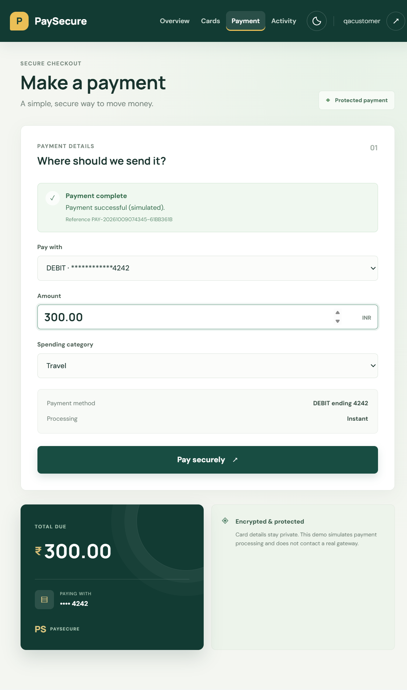

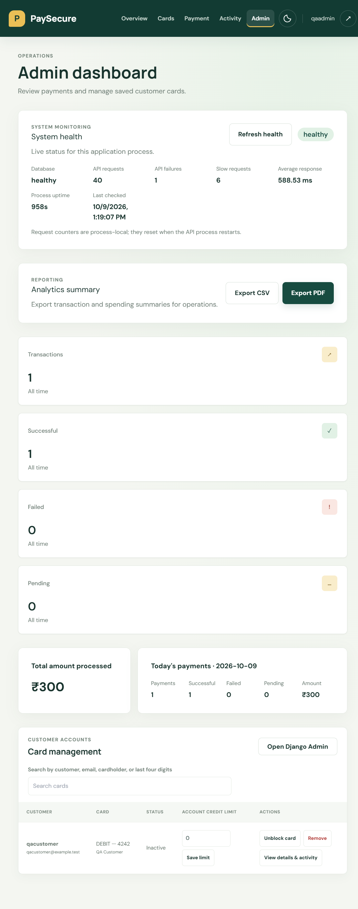

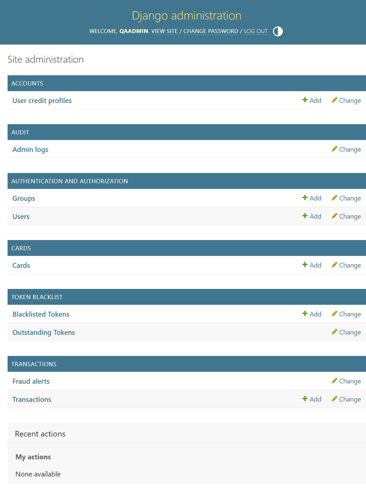

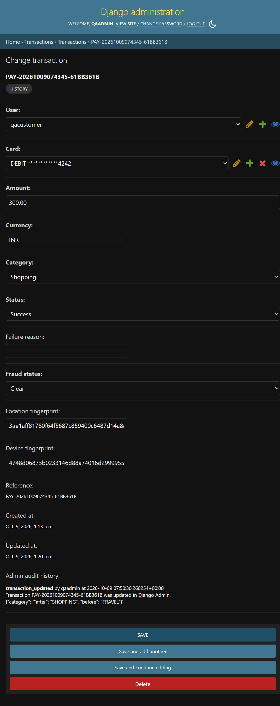

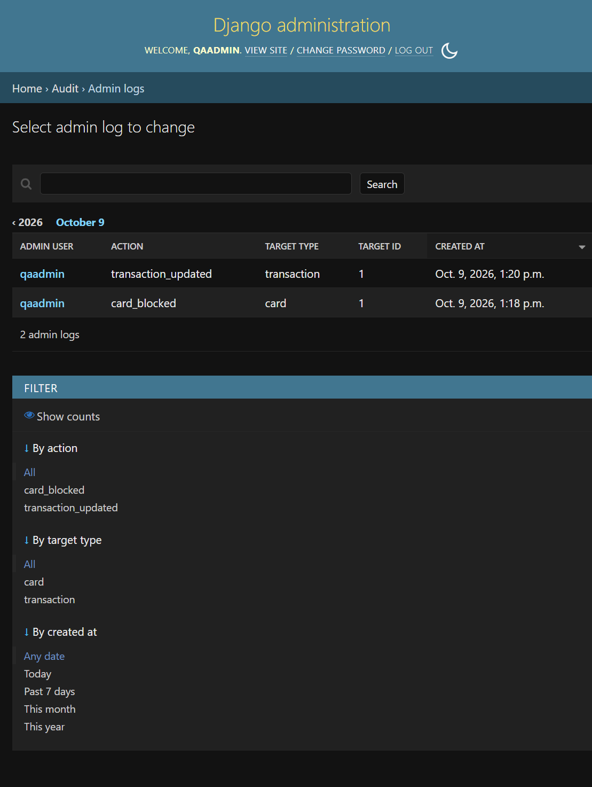

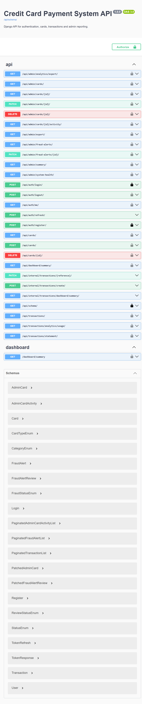

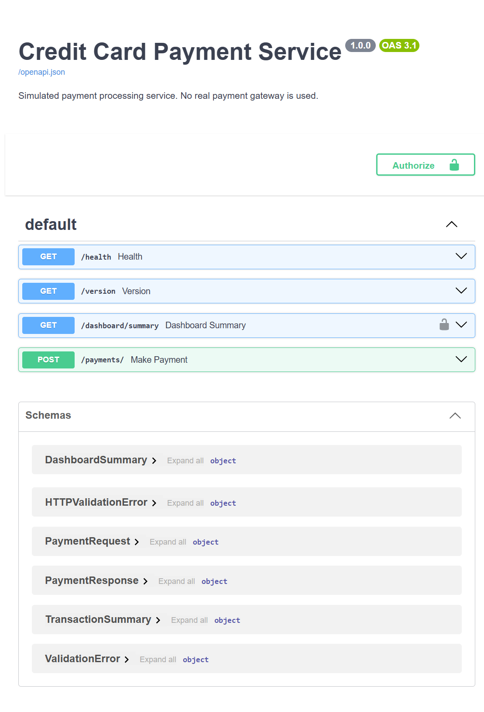

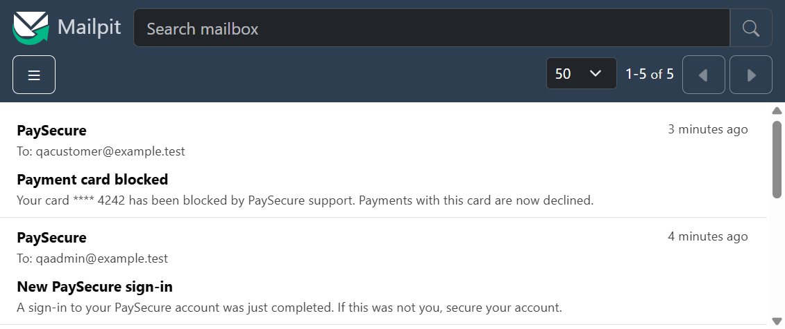

## Demo payment simulation

The frontend sends a card ID and amount to FastAPI. FastAPI creates a PENDING transaction through the Django internal API, then simulates success/failure and updates the transaction.

For deterministic testing:

- Amount ending in `.13` => FAILED
- Other valid amounts => SUCCESS

Example: `100.13` produces FAILED.

This is only a simulation and does not contact a payment gateway.

## API summary

Django:

- POST `/api/auth/register/`
- POST `/api/auth/login/`
- POST `/api/auth/refresh/`
- POST `/api/auth/logout/`
- GET `/api/auth/me/`
- POST `/api/cards/`
- GET `/api/cards/`
- DELETE `/api/cards/<id>/`
- GET `/api/transactions/`
- GET `/api/transactions/analytics/usage/`
- GET `/api/admin/export/` (staff/admin only)
- GET `/api/admin/summary/`

### Monitoring and analytics exports

Both Django and FastAPI log API method, path, status, and response duration;
failed responses are logged as warnings/errors, exceptions include a traceback,
and requests slower than `API_SLOW_REQUEST_THRESHOLD_MS` are additionally
flagged. The default slow-request threshold is 1000 ms. Set that environment
variable in the deployment environment to tune it.

Users with analytics permissions can open `GET /api/admin/system-health/` for
database connectivity and process-local request, failure, latency, uptime, and
slow-request counters. These counters reset on process restart and are not
shared between worker processes; use centralized metrics/log aggregation for
multi-worker or production monitoring.

Analytics summaries can be downloaded by analytics-role users through
`GET /api/admin/analytics/export/?file_format=csv` or `?file_format=pdf`. The Admin
dashboard exposes both formats alongside the system health panel.
The health panel refreshes automatically every 30 seconds and can be refreshed
manually.

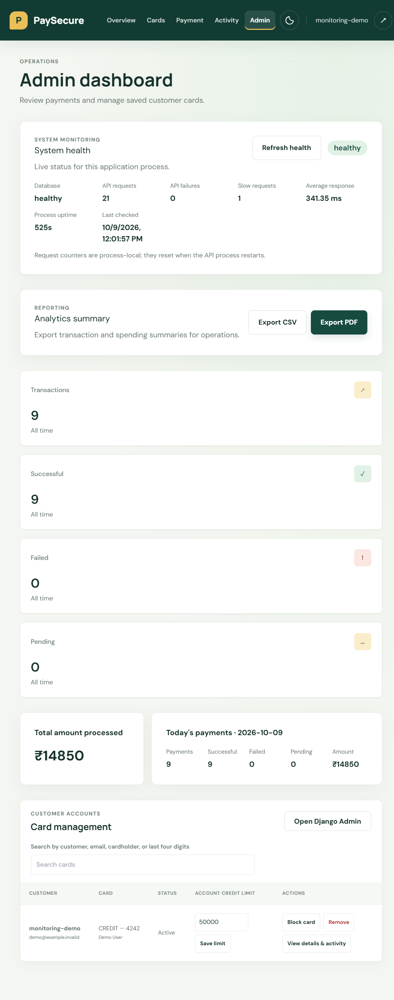

### Django Admin audit screenshots

The Admin logs screen supports searching and filtering transaction audit
records. Each transaction's Django Admin detail view also shows its own
chronological audit history. Users in the Django Admin role can add a
**manual note** to Admin logs; these entries are labeled `manual_note` and
cannot be edited or deleted. Admin-role users can also add a Fraud alert by
selecting a transaction and entering rule codes as a JSON list (for example,
`["manual_review"]`). This flags the transaction and records the manual alert
creation in Admin logs. Support and Read-Only roles can view fraud alerts but
cannot add alerts or audit notes.

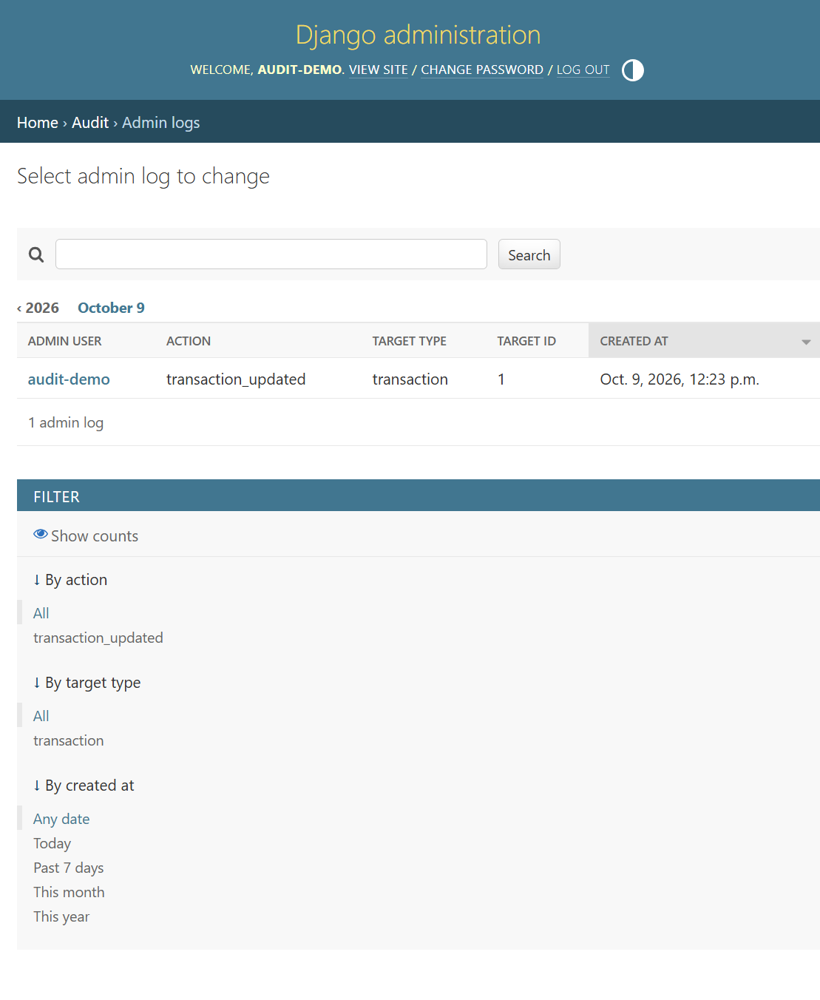

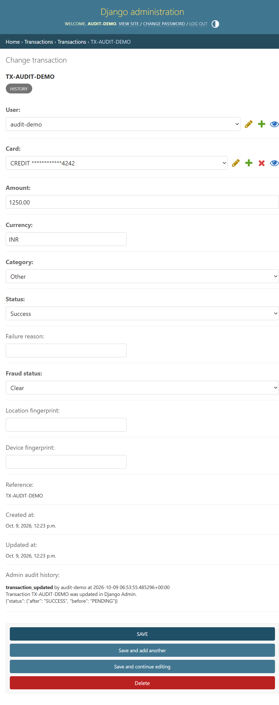

Transaction history is paginated (20 rows by default; `page_size` is capped at
100) and returns `count`, `next`, `previous`, and `results`. Optional query
parameters are `status`, `from_date`, `to_date`, `min_amount`, `max_amount`,
`card_search` (masked number or last four digits), and `ordering`. Sort fields
are `created_at`, `amount`, `status`, `reference`, and `category`; prefix a
field with `-` for descending order. Dates use `YYYY-MM-DD`.

The usage analytics endpoint returns six months of successful monthly spending,
category totals for the same period, all-time credit utilization, all-time
transaction status totals, and daily attempt counts for the last seven days.
Payment categories are selected at checkout (Food & dining, Shopping, Travel,
Bills & utilities, Healthcare, Entertainment, or Other); historical transactions
default to Other.

### API roles and permissions

The Django migration creates three role groups in `auth_group`; group permissions
are stored in `auth_group_permissions` and assigned to users through
`auth_user_groups`:

| Role | Permissions |
| --- | --- |
| Admin | View all cards and transactions, block/unblock and delete cards, update credit limits, and view analytics/export. |
| Support | View all cards and transactions, block/unblock cards, and view analytics/export. Credit-limit changes, card deletion, and payment initiation are not allowed. |
| Read-Only | View all cards and transactions, analytics/export, and fraud alerts. Card changes, payment initiation, and alert review are not allowed. |

Assign a role by editing the user's **Groups** in Django Admin. Existing staff
accounts are assigned the Admin group by migration; staff and superusers continue
to have Admin access. Customer card, transaction, dashboard, and statement APIs
remain authenticated and scoped to the signed-in user's own data.

Admin card and analytics routes accept these roles: `GET /api/admin/cards/`,
`GET /api/admin/cards/<id>/`, `GET /api/admin/cards/<id>/activity/`,
`PATCH /api/admin/cards/<id>/`, `DELETE /api/admin/cards/<id>/`,
`GET /api/admin/summary/`, and `GET /api/admin/export/`. Support can PATCH only
`is_active`; Admin can also update `credit_limit` and delete cards. Support and
Read-Only roles cannot add or remove cards through customer card endpoints or
submit payments through FastAPI. Admin and Support can review alerts at
`PATCH /api/admin/fraud-alerts/<id>/` using `{"review_status":"REVIEWED"}` or
`{"review_status":"FALSE_POSITIVE"}`. All three roles can list alerts at
`GET /api/admin/fraud-alerts/`; use `?review_status=OPEN` to filter them.

### Fraud detection and alerting

Each payment attempt is evaluated when its pending transaction is created.
Three or more transactions of at least ₹5,000 within a rolling 10-minute window
trigger the `repeated_high_value_transactions` rule. A different source IP or
device identifier compared with another transaction in the same window triggers
`rapid_location_change` or `rapid_device_change`. The source IP is a network
location proxy, not a geolocation result. The frontend sends a persistent random
browser ID in the `X-Device-ID` header; other clients may omit it, in which case
FastAPI uses the request's user-agent.
Identifiers are HMAC-fingerprinted before persistence and are not exposed in
transaction responses.

Detection flags the transaction and creates one reviewable fraud alert; it does
not automatically decline the simulated payment. An email is queued after the
database commit for the account holder and active staff/Admin/Support recipients.
Review status, reviewer, and review time are retained with the fraud record.

FastAPI verifies the JWT and forwards only the authenticated user ID to Django's
internal summary endpoint using the shared internal secret. Django queries
transactions and related cards; the recent-transactions query selects related card
data and is limited to five results. `total_amount_spent` includes all transaction
statuses; `current_month_spending` includes successful transactions only.
`available_credit_limit` is the account's configured limit minus successful
credit-card transactions, floored at zero. Configure limits in Django Admin under
**User credit profiles**; new profiles default to `0.00`.

The dashboard also lists recent successful transactions as payment receipts.
Users can view receipt details or download a self-contained HTML receipt; receipts
are for simulated payments and are not tax invoices.

FastAPI:

- GET `/dashboard/summary` (JWT required; total spend includes every transaction)
- POST `/payments/`
- GET `/health`
- GET `/version`
- Swagger `/docs`

## Database schema

| Table | Important fields | Sensitive data policy |
| --- | --- | --- |
| Django users | `id`, `username`, `email`, `password`, `is_staff` | `password` contains a Django password hash, never the plaintext password. |
| Cards | `id`, `user_id`, `card_type`, `masked_card_number`, `last4`, `card_holder_name`, `expiry_month`, `expiry_year`, `is_active` | No full card number or CVV columns are stored. |
| Transactions | `id`, `user_id`, `card_id`, `amount`, `currency`, `status`, `fraud_status`, `reference`, `failure_reason`, timestamps | References the saved card; payment is simulated and has no gateway credentials. Window-query and fraud-status indexes support fraud evaluation/review. |
| Fraud alerts | `id`, `transaction_id`, `user_id`, `rule_codes`, `review_status`, `reviewed_by_id`, `reviewed_at`, `detected_at` | One review record per flagged transaction; source location/device identifiers are HMAC-fingerprinted on transactions. |
| Admin logs | `id`, `admin_user_id`, `action`, `target_type`, `target_id`, `changes`, `details`, `created_at` | Structured audit records, including before/after values for card status, credit limits, transaction edits, and fraud-alert review; no card PAN or CVV fields. |

The Django migrations define the authoritative schema. MySQL is used for normal runs; `DJANGO_TEST_SQLITE=1` is available for isolated tests and local live demos.

## Sprint feature scope

### Email notifications

- Send the account holder an email when:
  - An account is registered or a successful sign-in occurs.
  - A card is added, removed, blocked, or unblocked, or the account credit limit changes.
  - A transaction is finalized as successful or failed.
  - A finalized transaction amount is greater than ₹5,000. This high-value alert applies to both successful and failed attempts.
  - Available credit crosses from at least 10% to below 10% of the credit limit after a successful credit-card transaction or credit-limit change. Available credit follows the dashboard calculation: limit less all successful credit-card transaction amounts.
- Include the transaction reference and masked card details when relevant; never include full card numbers or CVVs. Explicitly log and skip delivery when the account has no email address.
- Queue email work after database commit. Log delivery failures without undoing an already committed payment or card change.

The sample `.env.example` uses Django's console email backend, so local notifications are written to the Django process output. For SMTP delivery, set `EMAIL_BACKEND=django.core.mail.backends.smtp.EmailBackend` and configure `EMAIL_HOST`, `EMAIL_PORT`, `EMAIL_HOST_USER`, `EMAIL_HOST_PASSWORD`, `EMAIL_USE_TLS`, and `DEFAULT_FROM_EMAIL` in the local `.env`. Keep provider credentials out of source control.

### Dashboard appearance

- Manage the selected light/dark theme using React Context and a dashboard toggle.
- Switch colors smoothly (220 ms); respect `prefers-reduced-motion` by disabling animation.
- Persist the non-sensitive `theme` preference in browser local storage across reloads, app remounts, and sign-outs.
- Keep the toggle keyboard-operable with visible focus and an accessible name/state (`aria-pressed`); keep it visible on narrow screens.
- Apply readable palettes to dashboard surfaces, navigation, forms, tables, dialogs, and native controls in both themes.

### Monthly PDF statements

- Provide an authenticated download endpoint: `GET /api/transactions/statement/?month=YYYY-MM`.
- Validate the month; reject malformed values and future periods. Include only the signed-in user's transactions in the selected local-time month.
- Generate a professional PDF with account holder, covered dates and generation time; successful-spend total; transaction, success, failure, pending, and payment-method counts; and a dated transaction table.
- Include each transaction's reference, status, amount/currency, and card type with a masked number derived from the final four digits. Never put full card numbers or security codes in the PDF.
- Repeat table headings across pages and include page numbers, a branded header, and a privacy footer. Download as `paysecure-statement-YYYY-MM.pdf`.
- Dashboard users can select a month and download the statement from the **Monthly statement** panel.

### Staff card management

- Restrict card-management and card-activity endpoints to authenticated Django staff users; deny unauthenticated and non-staff users.
- Let staff search `GET /api/admin/cards/?search={term}` by customer username/email, cardholder name, or last four digits, and review the stored non-sensitive card details.
- Let staff block/unblock a card and update the customer's account credit limit through `PATCH /api/admin/cards/{id}/`.
- Prevent blocked cards from starting a payment; retain transaction history and reject card removal when transactions reference it.
- Expose per-card transaction activity at `GET /api/admin/cards/{id}/activity/`, paginated to 25 by default and capped at 100 per page.
- Never store or return full card numbers or CVVs. Surface permission and validation failures to the administrator.

Apply the card-status migration with `python manage.py migrate` before starting the updated application.

## Admin

Create a Django superuser:

```bash
python manage.py createsuperuser
```

Use those credentials for `/admin/`.

## Postman

Import:
`postman/Credit-Card-Payment-System.postman_collection.json`

Set:

- `django_url = http://localhost:8000`
- `fastapi_url = http://localhost:8001`
- `token` after login
- `refresh` after login (the Login request saves both JWTs automatically)
- `card_id` after adding a card

Use the **Dashboard Summary** request to call FastAPI `GET /dashboard/summary`;
the request asserts the response fields and that the recent transaction list is
limited to five entries.

## Screenshots

The six-page project implementation report, with product and live-test images,
is available at
[reports/card-payment-system-project-report.pdf](./reports/card-payment-system-project-report.pdf).
Regenerate it with `python reports/generate_project_report.py`.

The dashboard summary UI screenshot is available at
[submission/screenshots/dashboard-summary.png](./submission/screenshots/dashboard-summary.png).
The FastAPI route and example response are documented in
[submission/screenshots/fastapi-dashboard-summary.png](./submission/screenshots/fastapi-dashboard-summary.png).
The screenshot uses mocked API data and contains no real account information.
Other submission screenshots are in `submission/screenshots/`.

## Database dump

After testing with MySQL:

```bash
mysqldump -u root -p credit_card_db > credit_card_db.sql
```

Do not commit real passwords, secrets, CVVs, or production data.

## Tests

Each test watcher runs independently and reruns its suite when relevant files change. Open three terminals from the repository root (`credit-card-payment-system/`):

### Terminal 1: Django

```powershell
cd backend/django_backend
python -m pip install -r requirements.txt
$env:DJANGO_TEST_SQLITE = "1"
python -m pytest_watch --runner "python manage.py test"
```

### Terminal 2: FastAPI

```powershell
cd backend/fastapi_payment
python -m pip install -r requirements.txt
python -m pytest_watch
```

### Terminal 3: Frontend

```powershell
cd frontend
npm install
npm test
```

`Ctrl+C` stops each watcher. Django's `$env:DJANGO_TEST_SQLITE` setting remains in that terminal after the watcher stops. Before normal Django commands such as migrations or creating a superuser, clear it and migrate the configured database:

```powershell
Remove-Item Env:DJANGO_TEST_SQLITE -ErrorAction SilentlyContinue
python manage.py migrate
python manage.py createsuperuser
```

For a single non-watch test run, use `python manage.py test` in `backend/django_backend` (set `$env:DJANGO_TEST_SQLITE = "1"` first), `pytest` in `backend/fastapi_payment`, or `npm run test:run` in `frontend`.

Target at least 50% coverage for the assignment.
